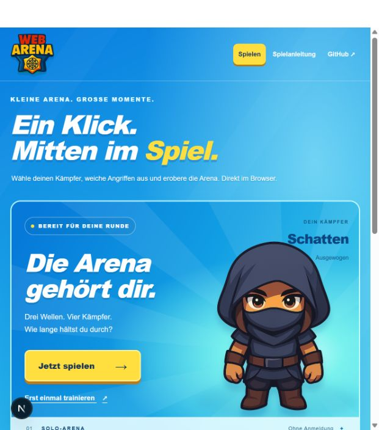

# WebArena

**Wähle deinen Kämpfer. Überstehe drei Wellen. Erobere die Arena.**

WebArena ist ein Browser-Spiel aus dem Studiengang Software and Information Engineering an der FH Vorarlberg. Die aktuelle Solo-Version läuft vollständig im Browser und verbindet die originale Spielkarte und Figuren mit einer hellen, farbenfrohen Oberfläche.



## Was du spielen kannst

- **Solo-Arena:** drei Wellen mit insgesamt zwölf Gegnern, die dich verfolgen und angreifen.
- **Training:** Bewegung, Zielen und Schiessen ohne Schaden üben.
- **Vier Kämpfer:** unterschiedliche Werte für Ausdauer, Tempo und Angriff.
- **Medikits und Tempo-Boosts:** Leben auffüllen und kurzzeitig schneller werden.
- **Pause, Neustart und Vollbild:** inklusive automatischer Pause bei Fokusverlust.
- **Touch-Steuerung:** Richtungstasten und ein Schussknopf für mobile Geräte.
- **Lokaler Bestwert:** Punkte und Siege bleiben auf deinem Gerät gespeichert.

Die Solo-Version benötigt keine Anmeldung, keinen Backend-Server und keine Datenbank.

## Multiplayer — Coming soon

Der Multiplayer-Modus war im ursprünglichen lokalen Studienprojekt bereits funktionsfähig: mit Lobby, gemeinsamen Spielsessions und Echtzeit-Kommunikation über WebSockets.

Für die aktuelle Solo-Demo wurde der Multiplayer-Einstieg vorübergehend aus der Oberfläche genommen. Die ursprüngliche Version setzt mehrere lokal betriebene Spring-Boot-Services, PostgreSQL und feste `localhost`-Adressen voraus. Diese Infrastruktur muss für einen gehosteten Betrieb wieder angebunden werden.

**Coming soon:** Die Rückkehr des Multiplayer-Modus für eine gehostete Umgebung ist geplant. Die bestehenden Multiplayer-Seiten und Backend-Services sind weiterhin im Repository enthalten.

## Lokal starten

### 1. Voraussetzungen

Installiere **Git** und **Node.js 24 inklusive npm**. Prüfe im Terminal:

```bash
git --version
node --version
npm --version
```

`node --version` sollte `v24.x.x` anzeigen.

### 2. Repository herunterladen

```bash
git clone https://github.com/berkanizgi/WebArena.git
cd WebArena/frontend
```

Wenn du das Repository bereits heruntergeladen hast, öffne ein Terminal im Ordner `WebArena/frontend`.

### 3. Abhängigkeiten installieren

```bash
npm ci
```

### 4. Spiel starten

```bash
npm run preview
```

Lass dieses Terminal geöffnet und rufe **[http://127.0.0.1:3100](http://127.0.0.1:3100)** im Browser auf. Wähle einen Kämpfer und klicke auf **Jetzt spielen** oder **Erst einmal trainieren**.

Zum Beenden drückst du im Terminal **Strg+C**. Die Vorschau ist nur auf deinem eigenen Computer erreichbar.

**Windows / PowerShell:** Falls PowerShell `npm.ps1` wegen der Ausführungsrichtlinie blockiert, verwende stattdessen:

```powershell
npm.cmd ci
npm.cmd run preview
```

**Port 3100 bereits belegt?** Beende die andere Vorschau oder starte auf einem anderen Port:

```powershell
# Windows / PowerShell
$env:PORT = "3101"
npm.cmd run preview
```

```bash
# macOS / Linux
PORT=3101 npm run preview
```

Öffne dann `http://127.0.0.1:3101`.

## Steuerung

| Aktion | Steuerung |
| --- | --- |
| Bewegen | WASD oder Pfeiltasten |
| Zielen | Maus bewegen |
| Schiessen | Linke Maustaste halten oder Leertaste |
| Pause / Fortsetzen | Escape |
| Vollbild | Vollbild-Button oberhalb des Spielfelds |
| Auf Touch-Geräten | Richtungstasten und Schussknopf auf dem Bildschirm |

Schüsse stoppen an Wänden. Auf Touch-Geräten zielt der Schussknopf automatisch auf den nächsten Gegner; die Schussbahn muss frei sein.

## Technologien und Projektaufbau

**Aktuelle Solo-Version:** Next.js 15, React 19, TypeScript, Phaser 3 und CSS. Die Spiellogik läuft im Browser, Bestwerte werden in `localStorage` gespeichert.

**Ursprüngliche Multiplayer-Architektur:** Java 21, Spring Boot, REST, STOMP/WebSockets und PostgreSQL.

| Service | Aufgabe | Lokaler Port |
| --- | --- | --- |
| GameService | Lobby, Sessions, Bewegungen und Angriffe | 8081 |
| CharacterService | Charaktere, Werte und Spieler-Zuordnungen | 8084 |
| MapService | Karte, Spawnpunkte und Gegenstände | 8080 |
| ShopService | Spielinterne Käufe und Belohnungen | 8083 |

Die vier Services gehören zur ursprünglichen Multiplayer-Version und müssen für den oben beschriebenen Solo-Start **nicht** gestartet werden.

Die Solo-Oberfläche liegt unter `frontend/src/components/arena`, die Spiellogik unter `frontend/src/solo`. Details zum bisherigen Aufbau und zur Hosting-Vorbereitung stehen in [docs/SOLO-PREVIEW.md](docs/SOLO-PREVIEW.md).

## Entwicklung prüfen

Führe diese Befehle in einem zweiten Terminal im Ordner `frontend` aus:

```bash
npm run test:solo
npm run check:solo
```

`test:solo` prüft Bewegung, Wegfindung, erreichbare Startpunkte auf der Originalkarte und gespeicherte Bestwerte. `check:solo` prüft den Solo-Code mit ESLint und den gesamten TypeScript-Quellcode.

Die aktuelle Version ist eine lokal spielbare Demo. Öffentliches Hosting und die erneute Multiplayer-Anbindung sind die nächsten Schritte.

## Grafiken

Die originale WebArena-Karte, das Logo und die vorhandenen Charaktergrafiken werden weiterverwendet. Die Lizenz der Kachelgrafiken liegt unter [frontend/public/map/Tiles/License.txt](frontend/public/map/Tiles/License.txt).
